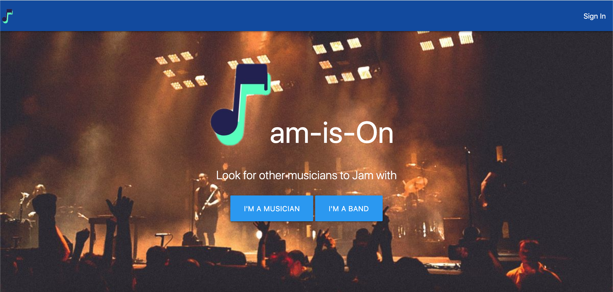

# Jam-is-on


# <a name="deployed"> Deployed Site </a>
Use the link to see the deployed site: https://github.com/kchoi123/jam-is-on

---

## Welcome to Jam-is-on!



---

# Table of Contents

- [Introduction](#introduction) 
- [Setup](#setup) 
- [Routes](#routes) 
- [Technologies Used](#technology) 
- [Deployed Site](#deployed)
- [Meet the Authors](#authors)
- [About Inspector Otter](#otter)

---

# <a name="introduction"> Introduction </a>
Jam-is-on is an app that efficiently allow musicians and bands to connect. 
* Are you a musician looking for a band?
* Do you have musical talent but having trouble find band members?
* Are you a band leader having trouble finding a drummer, vocalist, or guitar player? 

If you answered YES to any of the questions above, HAVE NO FEAR! Jam-is-on application is here to help YOU! 

<hr>

# <a name="setup"> Setup </a>

1. First, clone or download this repository. Then naviagate to its root directory in Terminal, and enter the following command:

```
$ npm i
```

### mySQL

2. Using your preferred mySQL IDE (e.g. mySQL Workbench) and the provided schema.sql file, setup a database on your machine.

### Power On!

3. After installing the dependencies and setting up a local database, return to the app's root directory in terminal and enter:

```
$ node server.js
```

---

# <a name="routes"> Routes </a>

URL | HTTP | Details:
--- | --------- | --------
/ | GET | Render landing page.
/signin | GET | Renders sign in page and sends user data to mySQL database.
/signup | POST | Posts new user to database.
/logout | GET | Logs specific user out and routes them to root page.
/musician | GET | Render dashboard page. Get all code snippets specific to logged in user (musician).
/findmybands | GET | Grabs all data for specific musician query from mySQL database and renders the main page, using jQuery to dynamically generate HTML.
/userinfo | GET | Grabs all user information from mysql database and renders on musician page.
/dashboard/updateSnippet | PUT | Updates snippet on mySQL database.
/dashboard/newSnippet | POST | Posts new snippets to mySQL database.
/dashboard/deleteSnippet | DELETE | Delete snippet from specific user's dashboard.
/library/:language/:id/:tag | GET | Gets all snippets for specific language and tag and displays them on page using handlebars.
---

# <a name="technology"> Technologies Used </a>

* JavaScript
* jQuery
* Node.js
* Express
* Express-handlebars
* Express-session
* Passport  *(Authentication)*
* mySQL *(Database)*
* Sequelize *(Database Query)*

---

# <a name="authors">Meet the Authors!</a>

|     Author           |  Summary|    Fun Fact         | Hobbies    |
|----------------------|---------|---------------------|------------|
|<b>Carlos Ponce :panda_face: <br> https://github.com/jcp510           |Blah blah blah | Blah blah blah | Watching sports :baseball:  |
|<b>Denis Galo :hatching_chick:   https://github.com/degalo93       | Denis Galo comes from a background in Biology and Bioinformatics. Using both computer science and biology he has helped with organizing   data in projects at SFSU and UCSF. Now he is working on becoming a full stack developer to create pages and apps that will help the scientific community. | Has a guitar pick that Carlos Santana gave to him personally.| Playing guitar, watching Netflix and traveling.  |
|<b>Kevin Choi :rice_ball:   https://github.com/kchoi123         |Kevin Choi comes from a background in IT Infrastructure specializing in hybrid system deployment using co-locations, AWS, Azure, Rackspace, and SoftLayer. His goal is to develop tools that will help collaborate hardware and software incompatibilities, both technologically and departmentally.| Kevin has played on the US Junior National Badminton Team.   | Netflix and sitting on the couch with his dog Polo :dog:|
|<b>Liam Condon :koala:    https://github.com/ltcondon     | Liam comes from a background of Economics and Environmental Studies, spending the majority of his career working in the Renewable Energy space, specifically with solar technologies.  | In his spare time, Liam enjoys playing guitar and riding his bike. He even once biked from Washington DC to Seattle! | Card Games, :spades: :hearts: :clubs: :diamonds: Bowling, :bowling: Swimming :swimmer: |
|<b>Lalitha Pelluri :cat:  https://github.com/lalithapelluri6  | Lalitha Pelluri comes from IT background.she has an experience on building front-end web applications using angular6.| in her spare time she likes to sing and gardening.she learned south indian carnatic music.| Hobbies include singing,Cooking, Gardening:herb, watching Netflix and travelling. | 


