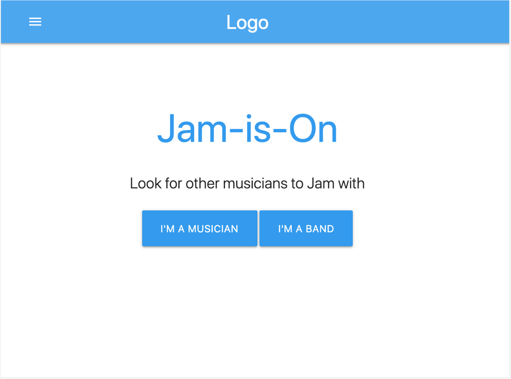

# Jam-is-on

# <a name="deployed"> Deployed Site </a>
Use the link to see the deployed site: https://github.com/kchoi123/jam-is-on

---

## Welcome to Jam-is-on!

---

# Table of Contents

- [Introduction](#introduction) 
- [Technologies Used](#technology) 
- [Deployed Site](#deployed)
- [Meet the Authors](#authors)
- [About Inspector Otter](#otter)

---

# <a name="introduction"> Introduction </a>
Jam-is-on is an app that efficiently allow musicians and bands to connect. 
* Are you a musician looking for a band?
* Do you have musical talent but having trouble find band members?
* Are you a band leader having trouble finding a drummer, vocalist, or guitar player? 

If you answered YES to any of the questions above, HAVE NO FEAR! Jam-is-on application is here to help YOU! 

---

# <a name="technology"> Technologies Used </a>

#### <a name="style"> HTML CSS BootStrap</a>

Upon loading our site, the user will see several items displayed on the screen. 

1) A background video of waves coming ashore.
2) A gray navigation bar at the top of the webpage displaying Inspector Otter's Logo to the left and a word search bar to the right with a yellow submit button. 
3) A search area to the left where users can input their location and find cafes near the location that was input (as people who search word definitions may be new to the area). 
4) An area where previously search words are displayed for the user to see. 
5) A dark-blue colored footer with a white  button. 

Upon clicking the  button for a search word within the navigation bar, the user will be shown the **Merriam-Webster** definition of the word and Gifs, along with several **new** buttons. The four new buttons that appear when a user searches a word are  and . When any one of the Spanish, Chinese, or Russian buttons are clicked, the searched word's **translation** will be displayed. See demo below when a user inputs a word into the search bar, submits the word and then clicks on the Spanish, Chinese and Russian translation buttons. 

When the unofficial definition button is clicked, the **Urban Dictionary** definition of the word searched is displayed. See demo below when a user clicks on the Unofficial Definition buttons. 

When a user inputs a location into the search bar of the cafe search function, images and other information regarding local cafes will be  displayed for user convenience. See demo below when a user submits a location into the location search bar. 

In terms of styling the webpage, we used <a name="bootstrap">BootStrap</a> to display the Navigation Bar, Footer, Buttons, a pop-up about page, and to make our website responsive. We also used our own CSS style sheet to change colors, fonts, positioning. Additionally we used the Inconsolata font from <a name="google"> Google Fonts</a> to display our text.

#### <a name="jumble">Jumble</a>

Jumble is a jQuery plugin that jumbles up the colors of your text headers, and can also be animated. We used this plugin to bring more color to our webpage. You can see the Jumble effect being used on the names of the authors in the About section of the website.

---

# <a name="authors">Meet the Authors!</a>

|     Author           |  Summary|    Fun Fact         | Hobbies    |
|----------------------|---------|---------------------|------------|
|<b>Carlos Ponce :panda_face:   https://github.com/jcp510           |Andrew is a recent college graduate with a degree in International Politics. He hopes that this bootcamp will be the first step towards a career in web development. |Andrew graduated from college in China. | Watching sports :baseball:  |
|<b>Denis Galo :hatching_chick:  https://github.com/degalo93       |UC Berkeley full-stack student with interests in moving into back-end web development. |Travels to a new country every year. | Traveling :airplane:, Next stop Japan :jp:  |
|<b>Kevin Choi :rice_ball:   https://github.com/kchoi123         |Kevin Choi comes from a background in IT Infrastructure specializing in hybrid system deployment using co-locations, AWS, Azure, Rackspace, and SoftLayer. His goal is to develop tools that will help collaborate hardware and software incompatibilities, both technologically and departmentally.| Kevin has played on the US Junior National Badminton Team.   | Netflix and sitting on the couch with his dog Polo :dog:|
|<b>Liam Condon :koala:   https://github.com/ltcondon     |Born and raised in the Bay Area, Jennifer has spent the last several years working in public accounting. She currently attends UC Berkley extension Coding Bootcamp with the hopes of switching careers into web and software development.| Jennifer has been skydiving!| Card Games, :spades: :hearts: :clubs: :diamonds: Bowling, :bowling: Swimming :swimmer: |
|<b>Maruthi Lalitha Pelluri Venkata Sesha :cat:  https://github.com/lalithapelluri6  |Shayan is a Bay Area native and UC Davis graduate in Design, who enjoys the outdoors and art. He is currently on the path to becoming a combo of UX designer, graphic designer, and software developer. | Shayan has an amazing cat named Phineas. :cat: | Drawing, Cooking, Gardening :herb: |